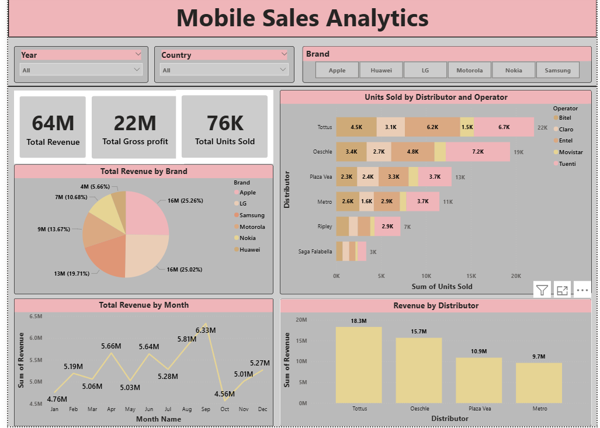
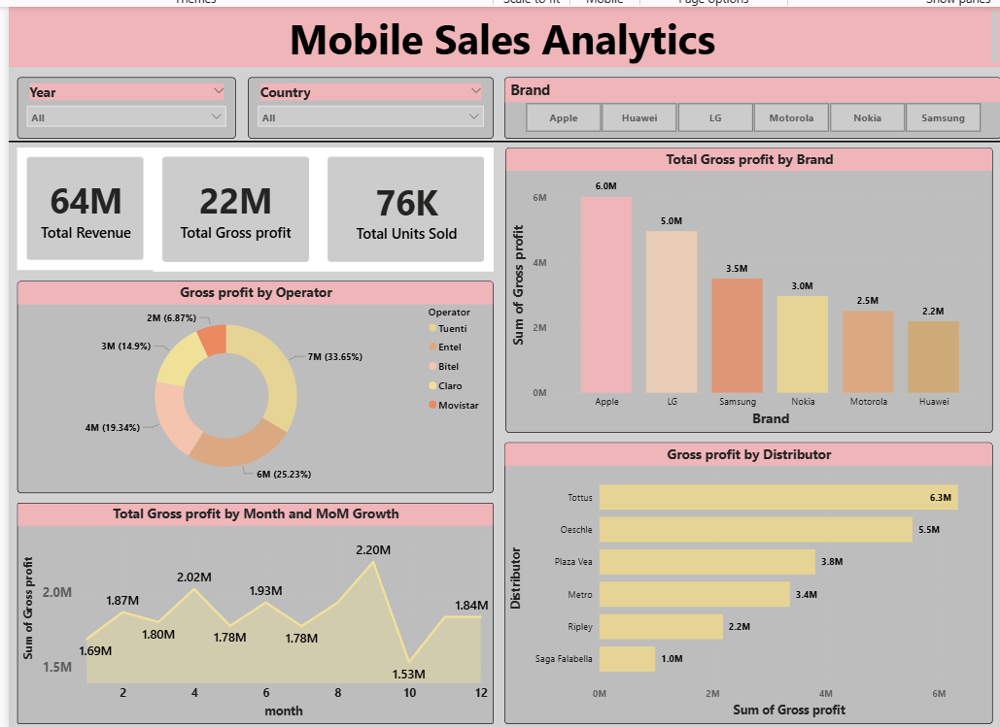

# Mobile Sales Analytics – Power BI Dashboard

An end-to-end Mobile Sales Analytics dashboard built in Power BI 
analyzing sales performance across brands, distributors, operators 
and regions.

## Project Overview
Built a 4-page interactive dashboard using real-world mobile sales 
data with dynamic slicers for Year, Country and Brand synced across 
all pages for seamless interactivity.

## Features
- KPI cards – 64M Revenue, 22M Gross Profit, 76K Units Sold
- Revenue breakdown by Brand, Month and Distributor
- Units Sold matrix across Distributors and Operators
- Monthly trend line with MoM growth tracking
- Gross Profit analysis by Brand, Operator and Distributor
- Data Table page for row-level exploration
- Tooltip page for hover-based insights across all visuals
- Cross-page slicers for Year, Country and Brand

## Key Insights
- Apple & Samsung each contribute ~25% of total revenue
- Tottus is the top distributor with 6.3M gross profit
- Entel leads operator-wise profit share at 33.65%
- June peaks at 6.33M revenue; January lowest at 4.56M
- Apple leads gross profit by brand at 6M; Huawei lowest at 2.2M
- Metro and Ripley underperform vs Tottus and Oeschle

## Tools Used
Power BI · DAX · Power Query · Data Modeling

## Getting Started
1. Clone the repo
2. Open `.pbix` in Power BI Desktop
3. Refresh data and explore!
